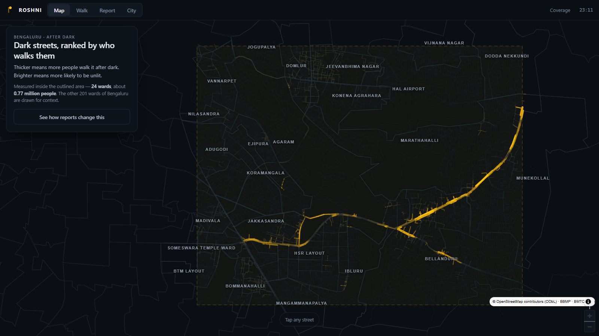
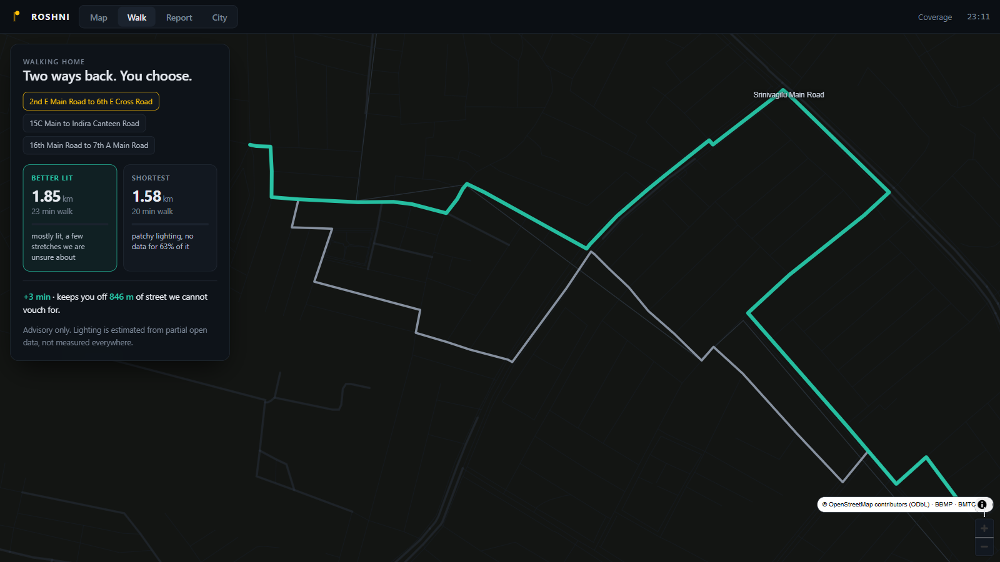
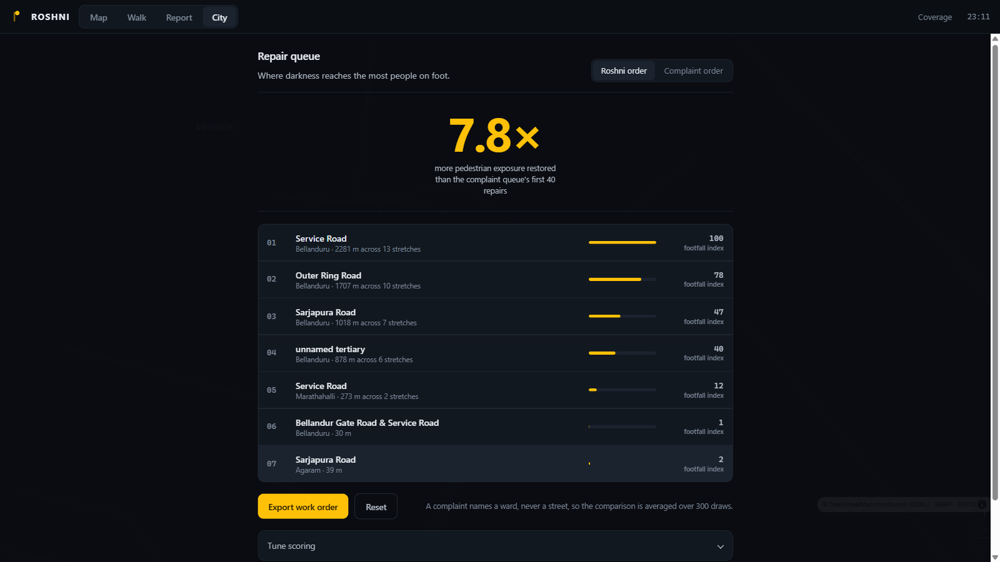
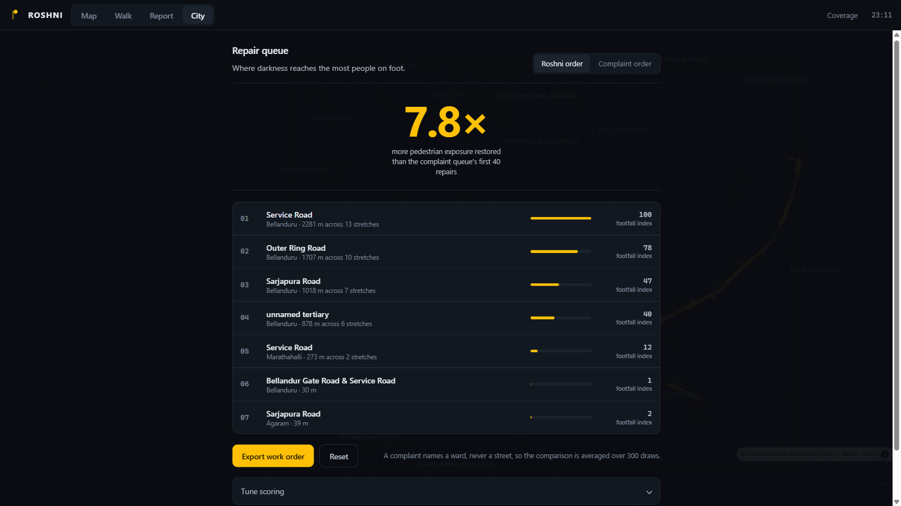
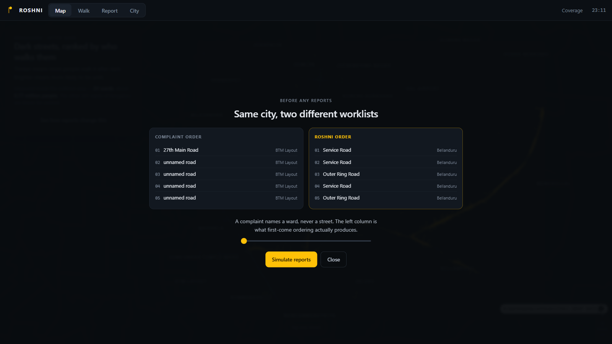
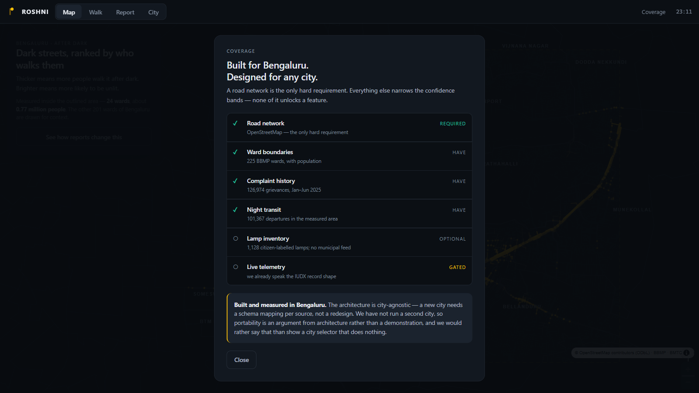
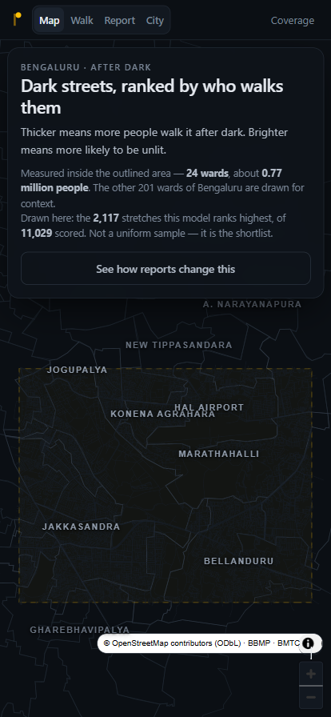

# Roshni — what is built

Branch `reimagine`, 22 Aug 2026. This is the state of the working prototype after
the presentation rebuild, with screenshots of the running app and the provenance
of every number on screen.

Nothing in `data/` changed. The pipeline, the beta-binomial posterior, the
exposure blend, the counterfactual and the routing graph are the same code that
produced the measured results. **What was rebuilt is what a judge sees.**

---

## Why it was rebuilt

A reviewer read the previous prototype and landed on one sentence:

> The current prototype makes the judge understand the implementation before they
> understand the product.

That was correct, and the diagnosis had four parts. Everything on screen had
equal visual weight, so there was no dominant object. The machinery — segment
counts, corridor kilometres, posterior variance, stress-test ratios, three weight
sliders — was on the surface before the product had said anything. The map was
bare GeoJSON linework with no labels and no city context, so it read as
`roads.json` rather than as Bengaluru. And the one deliverable the problem
statement names first, *"a public dark-zone risk map"*, had never been built as
its own screen.

The product itself is compact enough to say in one line:

> People report dark streets → Roshni estimates darkness → exposure changes what
> gets repaired and what gets recommended for walking.

Three things the audience has to hold: **dark**, **busy**, **decide**.

---

## The five surfaces

`Map · Walk · Report · City`, plus a Coverage panel on the header. Each screen
answers one question.

| Surface | The 3-second understanding |
|---|---|
| **Map** | these are the dark, busy streets |
| **Walk** | slightly longer, better lit |
| **Report** | one tap improves the data |
| **City** | repair this street before that one |
| **Coverage** | a road network is all it needs |

### Map — the public dark-zone risk map



The problem statement's first deliverable, now the default screen. All 225 BBMP
ward boundaries sit behind everything, the measured rectangle is outlined, and
the rest of the city is drawn as context. Ward names are labelled, so it is
recognisable as Bengaluru without a caption.

The encoding is the differentiator: **colour carries darkness, width carries
exposure.** A thick bright line is a street that is both unlit and heavily walked
— the only thing on the map worth acting on. The ORR corridor glowing amber
across the middle is that, visible before you read anything.

Clicking a street opens one card: how likely dark, night footfall in words, how
sure we are, and its repair rank. Nothing else.

### Walk — two routes, one decision



The routing half of the problem statement. Two cards, one decision, the map below
as proof the routes exist. **"Better lit" is a choice, not an alarm** — the
shortest way is always shown beside it.

Both figures are computed live from the current belief state, not hardcoded,
which is why they stay true after reports arrive:

> **+3 min** · keeps you off **846 m** of street we cannot vouch for.

The router prices wide-band segments at 9× rather than deleting them, so a route
always exists — it detours, it never fails. That is also why the safer route is
never a promise: we avoid what we do not know, we do not certify what we do.

### Report — one question



One tap, no account, no lamp number to hunt for in the dark. The screen names the
street you are standing on, takes one tap, and then shows the only thing that
matters: **the report moved that street up its ward's repair queue.**

Then it asks the question nobody asks: *the city says this was fixed — is it?*
Closure and repair are separate states, so a ward can be told what share of its
96.4% closure rate nobody on the ground ever confirmed.

Below that, three streets worth checking tonight — chosen by exposure ×
uncertainty, one per ward, with the reason in plain words. The targeting logic is
the answer to "how do you decide where to ask?", not a label on the screen.

### City — a list, not a console



A desk task on a Monday morning, so the map goes behind a scrim and the list is
the product. The ratio leads, then the queue, then the export.

Rows are **grouped by street and totalled** — "Service Road, Bellanduru, 2,281 m
across 13 stretches". OSM splits one road into many short ways, so the raw
ranking put four separate 170 m pieces of the same service road in the top five:
correct, and useless to read or dispatch against.

The budget slider and the three weight sliders live behind **Tune scoring**. They
are an excellent answer to a judge's question and a terrible first impression.
Confidence-as-texture is explained behind **How sure are we?** for the same
reason.

The output is a **CSV work order**, not a view. A dashboard that can only be
looked at is the documented failure mode of this whole category.

### The sequence — how reports change the city

Launched from the Map screen. Not a tab: a demo beat in three states.

**Before.** The two worklists side by side.



All five entries in complaint order sit in **one ward — BTM Layout, the ward that
files the most complaints.** Roshni's five span Bellanduru and Marathahalli, on
the ORR service roads. That contrast is the entire argument and it needs no
narration.

**Running.** One number, large, falling.


**The reveal.** At 1,200 reports:

> The walker's unknown ground fell from **63%** to **6%**. Meanwhile the top 40
> repairs changed by **1 street** — because 1,200 reports arrived from places that
> already report. Reports alone do not fix the ordering; that is what the exposure
> model is for.

The worklist barely moving is the finding, not a bug. It is the bias the product
exists to correct.

### Coverage — generality, with its limit attached



A header panel, not a fifth workflow, and deliberately **not** a city selector —
a judge would say "show me Mumbai" and we cannot. Instead, the input ladder:

| Source | Status | What we hold |
|---|---|---|
| Road network | **required** | OpenStreetMap — the only hard requirement |
| Ward boundaries | have | 225 BBMP wards, with population |
| Complaint history | have | 126,974 grievances, 1 Jan – 19 Jun 2025 |
| Night transit | have | 101,367 departures in the measured area |
| Lamp inventory | optional | 1,128 citizen-labelled lamps, no municipal feed |
| Live telemetry | gated | we already speak the IUDX record shape |

And the limit, stated rather than hidden:

> Built and measured in Bengaluru. The architecture is city-agnostic — a new city
> needs a schema mapping per source, not a redesign. We have not run a second
> city, so portability is an argument from architecture rather than a
> demonstration, and we would rather say that than show a city selector that does
> nothing.

### Mobile



414 × 896. Zero overflow, all four tabs reachable, the measured area framed in
the space the sheet leaves. Verified by walking the DOM for any element past the
viewport, not by eyeballing — `body` has `overflow:hidden`, so clipping is
silent and `scrollWidth` checks lie.

---

## The map layer system

Five layers, each with exactly one job, drawn back to front.

| Layer | Treatment | Job |
|---|---|---|
| Ward boundaries (225) | 0.5–1.2px hairline, dimmer outside scope | this is Bengaluru, and it is big |
| Measured rectangle | dashed brand outline, 3% brand fill | this is what we actually measured |
| Roads outside scope | 0.35px `#161D26` | texture, never read |
| Scored roads | **colour = darkness, width = exposure** | the product |
| Selected road | 6px pale brand, blurred | the one thing you are looking at |

The colour ramp is monotonic in brightness — dim grey to full amber — so
"brighter means more likely unlit" is literally what the eye reads. The previous
ramp ran cream to deep blue, which made **well-lit streets the brightest thing on
screen** and contradicted its own legend. That bug was found by looking at a
render, not by reasoning about the code.

### Labels are DOM, not a symbol layer

This is the one genuinely non-obvious technical decision. MapLibre rasterises
`text-field` from glyph PBFs fetched over the network. This page declares no
`glyphs` URL and makes **no network requests at all**, so a `symbol` layer would
have silently drawn nothing.

Labels are therefore absolutely-positioned DOM spans, projected with
`map.project()` and rebuilt on `move` behind a `requestAnimationFrame` guard.
Capped and culled by zoom, with a coarse grid claim for collision. Offline by
construction, and with real CSS typography.

On the Walk screen the labels become `START` / `HOME` pins, because the routing
graph spans the whole snapshot while names only exist for the scored subset — so
most segments on any given walk have no name at all.

---

## Numbers on screen, and where each comes from

`docs/measured-2026-08-22.md` is the authority. Where an older doc disagrees,
that file wins.

| On screen | Value | Source |
|---|---|---|
| Headline ratio | **7.8×** live / **7.73×** canonical | `out/stats.json`, 300 Monte-Carlo draws |
| Segments scored | 11,029 | `data/pipeline.py` |
| Corridor | 1,180 km | `data/pipeline.py` |
| Wards, city-wide | 225 | `bbmp_wards_2023.kml` |
| City population | 8,449,004 | same KML, `population` field |
| In the measured area | ~765,000 across 24 wards (9.1%) | area-weighted, `data/build_city.py` |
| Complaints | 126,974, Jan–Jun 2025 | `bbmp_grievances_2025.csv` |
| Electrical closure rate | 96.4% (40,632 of 42,138) | same file |
| Night departures | 101,367 in the measured area | BMTC GTFS |
| Labelled lamps | 1,128 (471 working, 657 not) | OSM `working=yes/no` |
| Prior-only share | 93.7% | `out/stats.json` |
| Walk trade-off | +3 min, 846 m | computed live per render |
| Unknown route share | 63% → 6% | computed live in the sequence |

**Robustness, for the questions rather than the screen.** 7.73× at a 40-repair
budget; **4.88×** against the luckiest of 300 baseline draws; **1.89×** against a
steelman that picks the worst street in every ward it visits; **6.4×** holding
geography and evidence coverage constant; **5.42×** with every lamp label we hold
deleted. The last two are the ones that matter — they say the win is not a
coverage artefact.

**One known discrepancy, recorded rather than hidden.** The app renders 7.8×
where the pipeline computes 7.73×. Same method, same 300 draws, different RNG —
mulberry32 in the browser against numpy in the pipeline. About 1% sampling noise.
**Quote 7.7× everywhere off-screen.**

---

## Problem-statement adherence

| PS text | Before | Now |
|---|---|---|
| "pedestrian-centric streetlight reporting" | Report tab | Report, one question |
| "…and routing system" | Walk tab | Walk, two cards |
| **"a public dark-zone risk map"** | **no such surface** | **Map, the default screen** |
| "weights repairs by pedestrian exposure" | City queue | City list, and now on the map itself |
| "recommends well-lit, safer alternate routes" | Walk tab | unchanged |
| Challenge: validate footfall with no official data | docs only | Coverage panel + this file |

The map deliverable went from absent to the default screen, and exposure went
from a column in a table to the width of every line on the map. Nothing
regressed.

### The challenge question

> *How would you validate a footfall estimate for a street where no official
> usage data exists at all?*

Not "beta-binomial posterior with UCB targeting" — that answers a question nobody
asked. The answer is a procedure:

1. **Estimate** from observable proxies: road class, connectivity, night-active
   land use, transit access, reported movement.
2. **Validate** by counting a sample — 10 to 20 streets spanning the predicted
   range, counted by hand or camera, prediction against observation.
3. **Calibrate**, and report the residual rather than burying it.

Then the line that makes it a product claim rather than a science claim:

> Roshni does not need a correct footfall number. It needs an **ordering** good
> enough to beat complaint order.

When answering this, quote the **ablations** — 5.42× with the lamp labels
deleted, 6.4× with coverage held constant — not the 7.7× headline. The headline
is computed against our own objective, so on its own it only shows the model
outscoring a naive baseline on a metric the model also defines. The ablations are
what show the ordering survives losing its evidence.

---

## Honesty corrections made during this build

Four things were wrong and are now fixed. Recording them because the same
failure modes will recur.

**Absolute footfall counts are gone.** An earlier pass of this very rebuild
printed *"237 people on foot / night"* per street, derived from the exposure
index times an arbitrary 1.35. That invents exactly the quantity the challenge
question says must be validated. Screens now show a **relative footfall index**,
and the citizen-facing card says it in words — *among the busiest*, *busier than
most*, *moderate*, *quiet*.

**Confidence was nearly deleted along with its legend.** 93.7% of segments run on
the ward prior alone. A bare "82% likely dark" would give a prior-only guess the
same visual authority as a lamp-evidenced one. The card now carries *measured /
partly known / estimated only*, and the texture legend moved behind a disclosure
rather than off the product.

**The complaint-history label said 2020–2025.** Those 126,974 rows are
**1 Jan – 19 Jun 2025** — a five-and-a-half-month window. Two older docs still
carry the error; the app does not.

**Ward population used centroids.** The first pass asked whether a ward's
centroid fell inside the demo rectangle. The rectangle is about the size of one
ward, so that misclassifies edge wards in both directions. Replaced with
Sutherland-Hodgman clipping and area-weighted population: about 765,000 across 24
wards, versus the centroid estimate of 788,462 across 21. Close enough to be
reassuring; defensible now. It still assumes even population density inside a
ward, which is why it is quoted as "about".

### Two more found by rehearsing the demo

Driving the actual demo end-to-end surfaced two inconsistencies that reading the
code would not have.

**The map card and the City queue disagreed about rank.** The card reported a
*segment* rank while the list reported a *street* rank, so Sarjapura Road showed
as #275 on the card and #3 in the queue. Both were true and impossible to
reconcile out loud. The card now ranks streets, using the same grouping the list
does.

**The hero label described the wrong list.** Toggling to Complaint order left
"more pedestrian exposure restored than the complaint queue's first 40 repairs"
sitting above the complaint queue itself. It now switches to name which list is
on screen: *"Below is the complaint queue's order. Roshni's first 40 repairs
restore 7.8× the pedestrian exposure this list does."*

---

## What is still open

**Criterion validation is unmined.** `data/raw/btp_road_safety_2023.pdf` and
`btp_crashes_2024.pdf` are downloaded and unread. This is the only independent
validation leg and the highest-value work left — it needs a highlighter, not a
parser.

**No field pedestrian counts.** Step 2 of our own answer to the challenge
question has not been executed.

**No second city.** Portability is an argument from architecture. Say so.

**`docs/ps-adherence.md` is stale** where it records the reporting screen as "not
built — mockup exists". It has been built since; that audit predates the citizen
surfaces and should be re-run rather than patched.

**The route table in `measured-2026-08-22.md` §6b is stale** — it describes a
two-query `routes.json` on the old sub-bbox, from before the full-bbox pipeline
rebuild. The app computes routes live, so the app is right and the table needs
regenerating.

---

## Running it

```bash
python -m http.server 8080 --directory web
# then open http://localhost:8080/index.html
```

One HTML file, vanilla JS, MapLibre GL as the only runtime dependency. **No
backend, no tile server, no auth, no network calls at demo time.** Requires the
local server rather than `file://` because it uses ES modules and `fetch`.

Offline payload, all precomputed:

| File | Size |
|---|---|
| `basemap.geojson` | 2.6 MB |
| `graph.json` | 2.5 MB |
| `segments.demo.geojson` | 1.4 MB |
| `scoring.json` | 1.1 MB |
| `city.geojson` | 144 KB |
| `city_labels.json` | 26 KB |
| `routes.json` · `stats.json` | 35 KB |

Regenerating the city layer after a pipeline change:

```bash
.venv/Scripts/python.exe data/build_city.py
cp out/city.geojson out/city_labels.json web/data/
```

`data/build_city.py` asserts 225 wards, a payload under 900 KB, and a scope share
between 5% and 20%, so a bad rebuild fails loudly instead of shipping.
